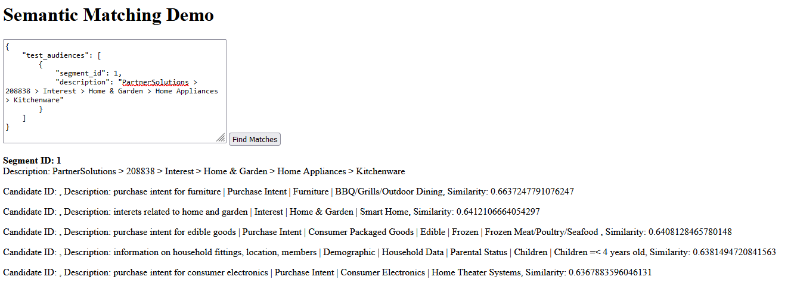

# Semantic Audience Matching API

## Project Introduction
This project creates a containerized Python API for performing semantic matching between audience segments. Given a description of an audience segment (or a list of segments), the API identifies the top k best semantic matches from the segment "source list". Additionally, the API provides a similarity score for the identified matches.

## Prerequisites
- Docker
- Python 3.12.2
- Flask 3.0.2
- pandas 2.2.1
- scikit-learn 1.4.1
- spaCy 3.7.4
- spaCy's trained pipelines for English, en_core_web_md version.

## How to Get the Project Code
```bash
git clone https://github.com/nixxxx/semantic-matching-API.git
```
## Building the Docker Image
### Obtaining the Image
You can directly download the semanticmatching_app image file from the Packages section of this repo.
Or build the image through the repo:
```bash
docker build -t semanticmatching_app .
```
## How to Run the Docker Container
```bash
docker run -p 5000:5000 semanticmatching_app
```
Access the API by clicking the link http://127.0.0.1:5000 from the Terminal or by directly entering http://127.0.0.1:5000 in your browser. A Flask framework is available for testing. Please enter text in JSON format that meets the requirements in the input box (a template format is available in this repo's test_audiences.json file) and press the submit button to see the results, such as similarities. Some features, such as displaying candidates' IDs, are not yet fully implemented.

### One example with Flask


## Some additions:
·Because it took a long time to make Flask, I didn't have time to do the API output. The output of an API can be found in Example_API_Output.json. In fact, line 54 of semanticMatching/__init__.py returns the output_segment part. Just combine the input_segment part to return a target result.

·This project uses Spacy's en_core_web_md trained pipeline and did not select Large or Transformers. The reason is that it takes into account containerization and time constraints and computer performance.
There are two aspects of impact:
1. Large models will take a lot of time to build images.
2. When running in containerization, many accidents occurred. Due to time constraints, there was no energy to solve them. However, this project can be optimized later and use better Measures to reflect the matching degree.

·About Scalability
Scalability can be achieved through algorithms that can be computed in parallel and through preprocessing and indexing methods. So that the results can be obtained quickly even with large amounts of data.

